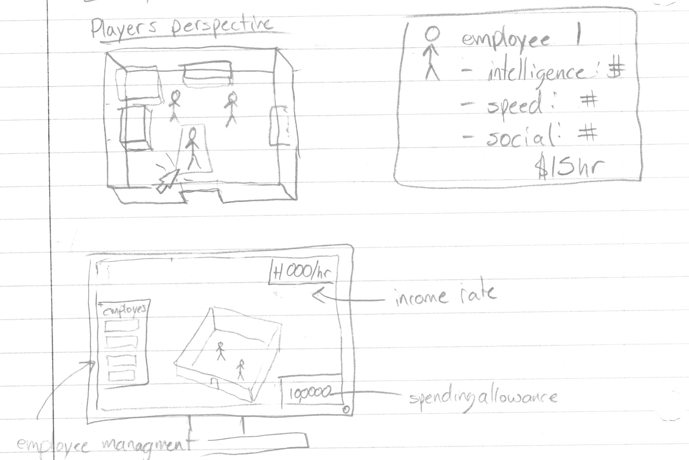

# BIG BIZ

## CS381 Final Project

#### Game Description
In Big Biz, players take on the role of a business owner. Hire employees, create workstations, and manage who works where in order to rake in the cash! With business expansion and employee management systems, this game has all the qualities you would expect in a management sim.

#### Concept Drawings

#### Game Components
1. 2D Physics, and wall collisions (not sure yet about workstation and employee collisions)
2. Unit AI with potential fields, and possibly group AI
3. Gameplay & User interaction (hand drawn), (devices, what does user do? scoring)
      * If VR
         - controller trigger press to select employee
         - controller trigger press to send selected employees to workstation
         - headset allows player to look around the business in 3D space
         - controller button press allows for workstation management
      * If PC
         - left click to pick employee
         - left click again to send to a work station
         - camera moves with WASD
         - right click allows for workstation management
4. No networking, single player
5. Sounds (background + game sounds)
  * background music: Vaporwave https://www.youtube.com/watch?v=aQkPcPqTq4M, elevator music https://www.youtube.com/watch?v=VBlFHuCzPgY
  * working sounds:
6. Branding guidelines(not required) 
   * color palette: https://coolors.co/f62dae-3d348b-256eff-7bdff2-fdfffc
   * font: 

## How to install

## How to play

## Development environment

## Contributors
- Group: Big Biz
   * Bryan Dedeurwaerder
      * Roles: programmer, ai, physics, art, gameplay (controls)   
   * Wei Tong
      * Roles: programmer, ai, physics, sound, UX (levels)
