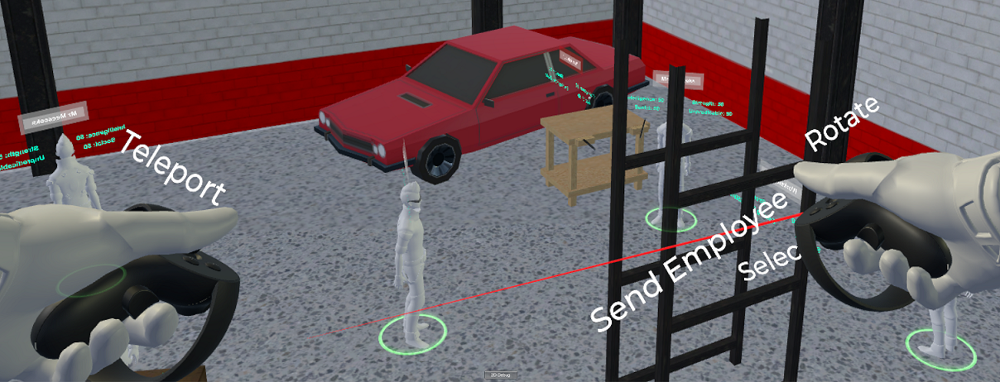

# BIG BIZ (Beta 1.1.2)
### A VR Business Management Simulation
#### This project was for a Game Engine Architecture course final project under the supervision of Professor Sushil J. Louis at the University of Nevada Reno.

## Play now!
Requirements:
* Hardware - Oculus Rift Touch VR Hardware
* OS - Windows 10 (or newer)
* Software - SteamVR (1.4.9 or newer), Oculus Rift compatible software

      1. Download the game [from Source Forge](https://sourceforge.net/projects/big-biz/)
      2. Ensure Oculus is plugged in and SteamVR is running
      3. Launch the executable

## Game Details
#### Description
In Big Biz, players take on the role of a business owner. Hire employees, create workstations, and manage who works where in order to rake in the cash! With business expansion and employee management systems, this game has all the qualities you would expect in a management sim.

#### Information
Genre: real time strategy (RTS) & management simulation  
* Gameplay Elements:
     - Player experiences game through VR headset
     - Player controls AI bots with the controller laser
     - Player grabs workstations with the controller
* Scoring System:
     - Player can earn money by working employees
     - Player can lose money by poor management
     - Player wins when revenue meets the requirements

#### Elements and Components
1. 2D Physics NPC movement, 3D Physics for workstations colliders
2. Unit AI, and group AI move too commands
3. Gameplay & User interaction
   - UI elements are interactable as they exist in world space
   - Player teleports to avoid motion sickness
   - Physical objects are interactable through controller input

4. No networking, single player
5. Sounds (background + game sounds)
     * All level songs are from the artist Mindthings
     * We made the laser sounds
     * Main menu song [credit](https://soundimage.org/fantasywonder/)
6. Branding guidelines(not required)
     - We ensured to use consistent logos, fonts and color schemes through out the game.
7. 3D Models were obtained from the Unity Asset Store

## Development environment
Game Engine: Unity version 2018.3.13f1  
Required VR Software: Oculus and Steam VR  
VR Hardware: Oculus Rift Touch c.3  

## Contributors
  * Bryan Dedeurwaerder: programmer, ai, physics, art, gameplay (controls)   
  * Wei Tong: programmer, ai, physics, sound, UX (levels)

- Under the supervision of [Professor Sushil J. Louis](https://www.cse.unr.edu/~sushil/)
